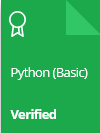
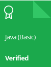

    

<h1>HackerRank | Practice, Tutorials, Test & Interview Preparation Solutions</h1>

This repository consists of solutions to HackerRank practice, tutorials, test and interview preparation problems with <b>Python</b>, <b>Java</b>, and <b>C++</b>.

    
## Disclaimer
The problem solutions and implementations are entirely provided by <a href="https://github.com/themalakarraja">Raja Malakar</a>. Purpose of the written code is to practice and pass all the platform tests of a given problem.

## Table of Contents

<ol id="table-of-contents">
    <li><a href="https://github.com/themalakarraja/HackerRank-Solutions/tree/master/30-days-of-code">30 days of code</a></li>
    <li><a href="https://github.com/themalakarraja/HackerRank-Solutions/tree/master/certification-python-basic">Certification python basic</a></li>
    <li><a href="https://github.com/themalakarraja/HackerRank-Solutions/tree/master/problem-solving">Problem solving</a></li>
    <li><a href="https://github.com/themalakarraja/HackerRank-Solutions/tree/master/python">Python</a></li>
</ol>

## Personal HackerRank Profile

[View Profile](https://www.hackerrank.com/themalakarraja)

## HackerRank Badges

## HackerRank Certificates

